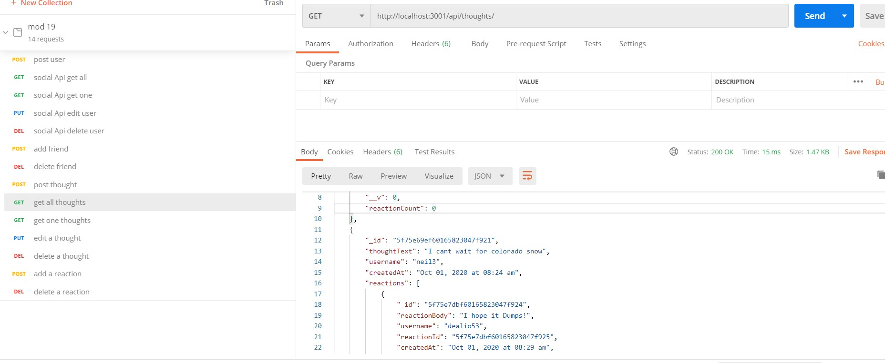

# Social Media Api

## Overview

This project is the backend for a social media app.  It can handle a lot of unstructured data using mongo DB, a noSQL database

 ## Routes in action :
 Video 1:
 https://drive.google.com/file/d/1OwL6UvKZmOxb57TZzBMT6XdH90pOG7oG/view

 Video 2: 
 https://drive.google.com/file/d/1nc8koZLKAcQ_Kx4Ituj-oj8NjzQeEvRV/view

 ### Features

 This backend has routes to add the capabilities to do the following: 
 * Create new users
 * View all users
 * View single user by id
 * Edit a User
 * Delete a User
 * Add and Remove friends for a user
 * Create, Edit and Delete thoughts belonging to a user
 * view all and view a single thought
 * comment on the Thoughts through reactions
 * Delete Reactions

 ### Technologies

 * Node JS
 * Mongo DB
 * Express
 * Mongoose
 * Moment

## Testing
Test apis through postman or insomnia

## Usage

Run Npm install to install the necessary NPM packages then use NPM start to start the server.  Test endpoints in postman or insomnia

## Contributions 

Jack Hoover

